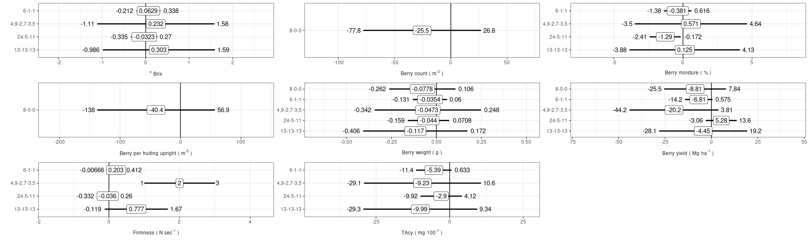
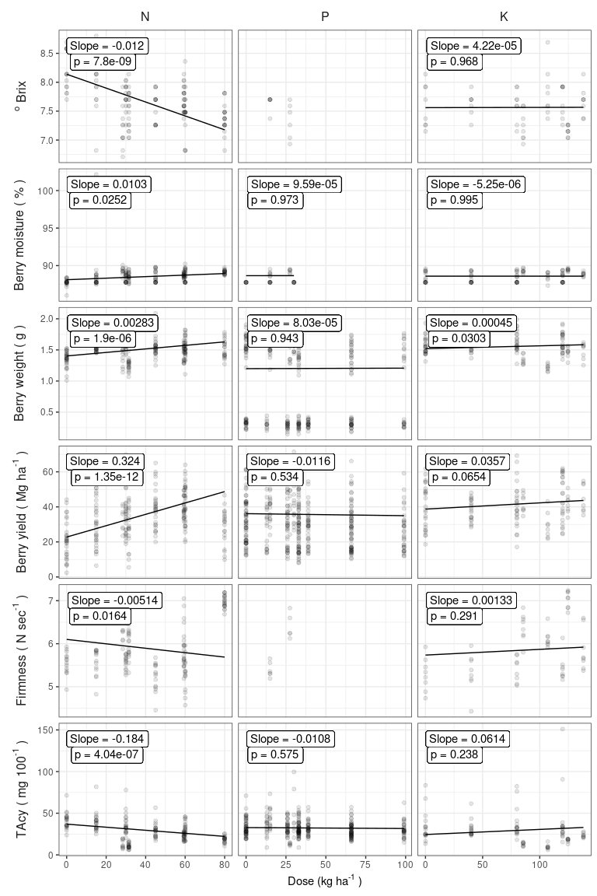
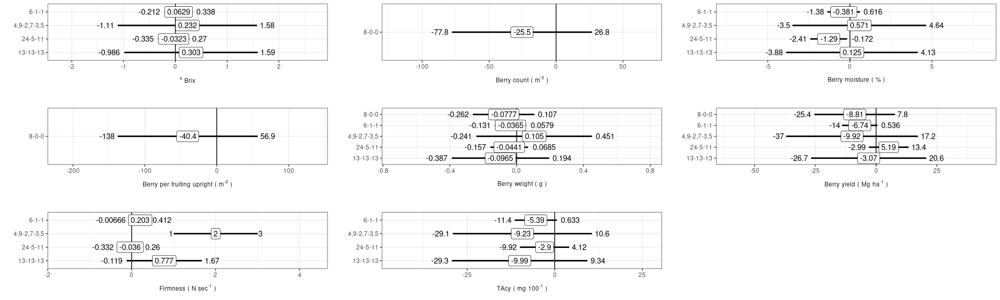
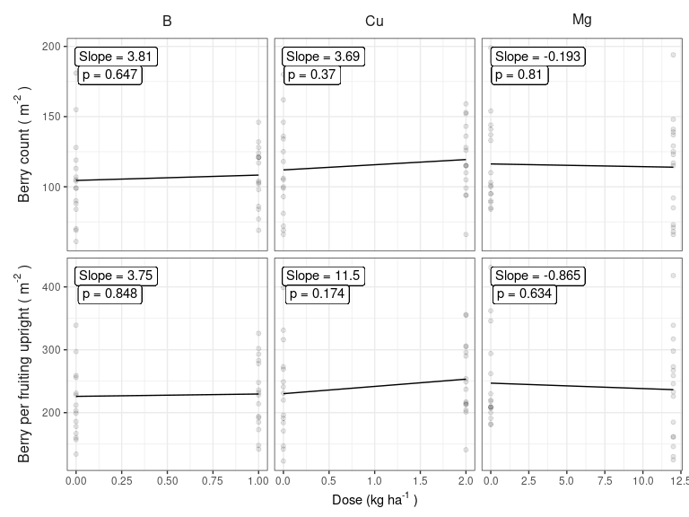

Nutrient Requirements of Conventionally and Organically Grown Cranberry
(*Vaccinium macrocarpon* Ait.) - Statistics
================
Serge-Étienne Parent

When managing cranberry nutrition, growers are most interested in
determining the factor(s) that limit growth and yield. In this notebook,
we correlate the performance of cranberry production with fertilizers.

The performance of cranberry production can be assessed by the following
metrics.

  - number of flowers per reporductive uprights (count)
  - fruit set (ratio of berry counts to flower counts)
  - berry counts per fruiting upright (count)
  - average berry weight (\(g \cdot berry^{-1}\))
  - marketable yield (\(Mg \cdot ha^{-1}\))
  - berry quality
  - total anthocyanins (TAcy)
  - total soluble solids (Brix)
  - firmness

We tested fertilizers provides the following nutrients: N, P, K, Mg, Cu,
B, and S.

## Initiate session

To initiate the session, we load the following libraries.

``` r
library("tidyverse") # generic data handling and plotting
library("nlme") # mixed models
library("grid")
library("gridExtra")
```

All data are placed in a single csv file.

``` r
data_init <- read_csv(file="data/data_init.csv", guess_max = 1729)
```

### Arrange data

A couple of data handling is needed for the analysis. First, some
variable types must be changed. First, TAcy is a performance indicator.
It is stored in two different columns, depending on the methodology. It
merge in a single column depending on the presence/absence of data.

``` r
data_init <- data_init %>% 
  mutate(TAcy = ifelse(!is.na(Fruit_Tacy_labo_mg_Anth_100g),
                       Fruit_Tacy_labo_mg_Anth_100g,
                       Fruit_Tacy_image_mg_Anth_100g_515nm))
```

To go on with subsequent operations, I need reference tables. The first
one links nutrients to the name of the column where the dosage value is
stored.

``` r
dose_df <- tibble(dose_colname = c("Fertilizer-tot-dose_N_kg_ha", "Fertilizer-tot-dose_P_kg_ha",
                                   "Fertilizer-tot-dose_K_kg_ha", "Fertilizer-tot-dose_Mg_kg_ha",
                                   "Fertilizer-tot-dose_B_kg_ha", "Fertilizer-tot-dose_Cu_kg_ha"),
                  dose_name = c("N", "P", "K", "Mg", "B", "Cu"))
```

The second reference table links crop performance to the columns where
the value is stored, and label which will be used for plotting later
on.

``` r
performance_df <- tibble(performance_name = c("TAcy", "Brix", "Firmness", "Berry_weight",
                                              "Berry_moisture", "Yield",
                                              "Fruit_stem", "Fruit"),
                         performance_colname = c("TAcy","Fruit_Brix_degreeBrix", "Fruit_Firmness_N_s", "Fruit_weight_g",
                                                 "Fruit_moisture_berry_perc", "Fruit_yield_Mg_ha", 
                                                 "Fruiting_upright_Nb_m2", "Nb_Fruit_m2"),
                         performance_labels = c("TAcy~plain('(')~mg~100^{plain('-1')}~plain(')')",
                                                "{}^o~Brix",
                                                "Firmness~plain('(')~N~sec^{plain('-1')}~plain(')')",
                                                "Berry~weight~plain('(')~g~plain(')')",
                                                "Berry~moisture~plain('(')~plain('%')~plain(')')",
                                                "Berry~yield~plain('(')~Mg~ha^{plain('-1')}~plain(')')",
                                                #"Reproductive~upright~plain('(')~m^{plain('-2')}~plain(')')",
                                                #"Flower~count~plain('(')~m^{plain('-2')}~plain(')')",
                                                #"Flower~per~repr.~upright~plain('(')~m^{plain('-2')}~plain(')')",
                                                #"Fruiting~upright~plain('(')~m^{plain('-2')}~plain(')')",
                                                "Berry~count~plain('(')~m^{plain('-2')}~plain(')')",
                                                "Berry~per~fruiting~upright~plain('(')~m^{plain('-2')}~plain(')')" # "Fruit~set~plain('(%)')",
                         ),
                         performance_type = c("Quality", "Quality", "Quality", "Quality",
                                              "Quality", "Quality",
                                              "Physiology", "Physiology"))
```

The next chunk creates a column where I store the dose of the
corresponding trial.

``` r
data_init$Dose_trial <- NA
for (i in seq_along(dose_df$dose_name)) {
  filter_i <- data_init$Nutrient_tested == dose_df$dose_name[i]
  filter_i[is.na(filter_i)] <- FALSE
  data_init$Dose_trial[filter_i] <- data_init[filter_i, dose_df$dose_colname[i]] %>% pull()
}
```

Finally, I create a simpler table where I retain only the fertilizers
columns, performance columns, fertilizer type and columns describing
experimental design. Then, yield was markedly reduced by 75% in 2017 due
to adverse meteorological conditions in winter and spring. Year 2017 was
thus discarded, I’m considering only data before 2017.

``` r
data_stats <- data_init %>%
  select(Year_of_experiment, Field_no, Treatment_no, Block_no, Cropping_system, Nutrient_tested, Fertilizer_formula, Dose_trial,
         dose_df$dose_colname, performance_df$performance_colname) %>%
  filter(Year_of_experiment != 2017) %>% 
  rename(Year = Year_of_experiment,
         Field = Field_no,
         Treatment = Treatment_no,
         Block = Block_no,
         Fertilizer_trial = Nutrient_tested) %>%
  droplevels()

data_stats %>% 
  sample_n(10)
```

    ## # A tibble: 10 x 22
    ##     Year Field Treatment Block Cropping_system Fertilizer_trial Fertilizer_form…
    ##    <dbl> <chr> <chr>     <dbl> <chr>           <chr>            <chr>           
    ##  1  2018 45    Mg12          1 Conventional    Mg               <NA>            
    ##  2  2014 C11   <NA>         NA Conventional    <NA>             <NA>            
    ##  3  2018 A9    S1000         2 Organic         S                4,9-2,7-3,5     
    ##  4  2008 4     <NA>         NA Organic         <NA>             <NA>            
    ##  5  2000 CA27  P11           6 Conventional    P                11-52-0 et 11-3…
    ##  6  2014 45    B1            2 Conventional    B                0-0-0-21        
    ##  7  2013 D     <NA>          3 <NA>            <NA>             <NA>            
    ##  8  2014 10    Cu2           1 Conventional    Cu               0-0-0-25        
    ##  9  2016 45    K40           2 Conventional    K                0-0-50; 0-0-22-…
    ## 10  2014 9     B0            2 Conventional    B                <NA>            
    ## # … with 15 more variables: Dose_trial <dbl>,
    ## #   `Fertilizer-tot-dose_N_kg_ha` <dbl>, `Fertilizer-tot-dose_P_kg_ha` <dbl>,
    ## #   `Fertilizer-tot-dose_K_kg_ha` <dbl>, `Fertilizer-tot-dose_Mg_kg_ha` <dbl>,
    ## #   `Fertilizer-tot-dose_B_kg_ha` <dbl>, `Fertilizer-tot-dose_Cu_kg_ha` <dbl>,
    ## #   TAcy <dbl>, Fruit_Brix_degreeBrix <dbl>, Fruit_Firmness_N_s <dbl>,
    ## #   Fruit_weight_g <dbl>, Fruit_moisture_berry_perc <dbl>,
    ## #   Fruit_yield_Mg_ha <dbl>, Fruiting_upright_Nb_m2 <dbl>, Nb_Fruit_m2 <dbl>

## Mixed modeling

Combination of performance-treatment will be subjected to a mixed model,
but some with a linear model, and other with a quadratic model.
Moreover, some combinaisons of performance-treatment were not tested. We
aim to loop each possible combinaison to fit a linear model, a quadratic
model or no model at all. The first step of this process is to create a
grid of these
combinaisons.

``` r
model_conditions <- expand.grid(performance_name = performance_df$performance_name, 
                                Fertilizer_trial = c("N", "P", "K", "Mg", "B", "Cu"))
model_conditions$index <- 1:nrow(model_conditions)
model_conditions %>%
  sample_n(5)
```

    ##   performance_name Fertilizer_trial index
    ## 1       Fruit_stem                K    23
    ## 2             Brix                P    10
    ## 3         Firmness               Cu    43
    ## 4             TAcy               Cu    41
    ## 5   Berry_moisture               Cu    45

We are adding a column to the grid containing the information on which
option to choose. By default, the option is linear.

``` r
model_conditions$model_type <- "linear"
```

Where the modeling threw erors due to lack of data, I imposed `"none"`
as
`model_type`.

``` r
model_conditions$model_type[model_conditions$Fertilizer == "B" & model_conditions$performance_index == "Brix"] <- "none"
```

The following instructions impose a quadratic model to some
combinaisons. We selected quadratic where it visually seemed
appropriate.

``` r
model_conditions$model_type[model_conditions$Fertilizer == "N" & model_conditions$performance_index == "Yield"] <- "quadratic"
model_conditions$model_type[model_conditions$Fertilizer == "N" & model_conditions$performance_index == "Berry_weight"] <- "quadratic"
model_conditions$model_type[model_conditions$Fertilizer == "K" & model_conditions$performance_index == "Yield"] <- "quadratic"
model_conditions$model_type[model_conditions$Fertilizer == "K" & model_conditions$performance_index == "Berry_weight"] <- "quadratic"
```

### Effect of nitrogen source

We hypothesized (\(H_0\)) that cranberry quality and physiology don’t
respond N sources after dicarding the dose effect. We test the linear
and quadratic effects of dose and the linear effect of fertilizer type.
We extract the effect of the fertilizer type from the model. The
following cell runs mixed models on nitrogen trials and save them in a
list.

``` r
alpha <- 0.05
lmm_N <- list()
interval_lmmN <- list()

mc_N <- model_conditions %>% 
  filter(Fertilizer_trial == "N")

for (i in 1:nrow(mc_N)) {
  performance_i <- performance_df$performance_colname[performance_df$performance_name == as.character(mc_N[i, 1])]
  model_type_i <- mc_N[i, 4]
  
  table_mm_i <- data_stats %>%
    filter(Fertilizer_trial == "N") %>%
    select(one_of(c("Year","Field", "Treatment", "Block", "Fertilizer-tot-dose_N_kg_ha","Cropping_system", "Fertilizer_formula", performance_i))) %>%
    rename(Dose = "Fertilizer-tot-dose_N_kg_ha") %>%
    drop_na()
  
  table_mm_i$Fertilizer_formula <- relevel(factor(table_mm_i$Fertilizer_formula), ref = "21-0-0")
  
  if (model_type_i == "linear") {
    lmm_N[[i]] <- lme(as.formula(paste0(performance_i, " ~ Dose + Fertilizer_formula ")),
                      random = ~ 1 + 1|Year/Field/Treatment,
                      data = table_mm_i)      
  } else if (model_type_i == "quadratic") {
    lmm_N[[i]] <- lme(as.formula(paste0(performance_i, " ~ Dose + I(Dose^2) + Fertilizer_formula")),
                      random = ~ 1 + 1|Year/Field/Treatment,
                      data = table_mm_i)
  } else if (model_type_i == "none") {
    lmm_N[[i]] <- NA
  } else {
    print("Model type not recognized. Choose linear or quadratic.")
  }
  
  tTable <- summary(lmm_N[[i]])$tTable%>%
    data.frame() %>%
    rownames_to_column() %>%
    filter(str_detect(rowname, "Fert"))
  
  intervals <- intervals(lmm_N[[i]], which = "fixed")[[1]] %>%
    data.frame() %>%
    rownames_to_column() %>%
    filter(str_detect(rowname, "Fert")) %>%
    bind_cols(tTable["p.value"])
  
  intervals$rowname <- tTable$rowname <- gsub("Fertilizer_formula*", "", tTable$rowname)
  
  intervals$performance_name <- mc_N$performance_name[i]
  intervals$performance_labels <- performance_df$performance_labels[performance_df$performance_colname == performance_i]
  
  interval_lmmN[[i]] <- intervals
}
```

Transform the `interval_lmmN` list to a table.

``` r
interval_lmmN <- do.call(rbind.data.frame, interval_lmmN)
interval_lmmN$pvalue_alpha <- ifelse(interval_lmmN$p.value <= alpha, paste("≤", alpha), paste(">", alpha))
```

Slopes and their 95% confidence intervals are plotted for each
performance index.

``` r
plot_cols <- 4
plot_rows <- 3

interval_lmmN %>% ggplot(aes(x = est., y = rowname)) +
  facet_wrap(. ~ performance_labels, scales = "free", labeller = label_parsed, switch = "x") +
  geom_vline(xintercept = 0, lty = 1) +
  geom_segment(mapping = aes(x = lower, xend = upper, yend = rowname), size = 1) + # , colour = pvalue_alpha
  geom_point(size = 3) +
  geom_text(aes(x = lower, label = signif(lower, 3)), hjust = 1.2) +
  geom_label(aes(label = signif(est., 3))) +
  geom_text(aes(x = upper, label = signif(upper, 3)), hjust = -0.2) +
  labs(y = "", x = "") +
  scale_x_continuous(expand = expand_scale(mult = c(0.5, 0.5))) +
  theme_bw() +
  theme(strip.text.y = element_text(angle = 0),
        axis.title.x = element_blank(),
        strip.background = element_rect(fill = "transparent", colour = "transparent"),
        strip.placement = "outside") +
  ggsave("images/sources-nitrogen.pdf", width = plot_cols * 5, height = plot_rows * 2, dpi=300) +
  ggsave("images/sources-nitrogen.png", width = plot_cols * 5, height = plot_rows * 2, dpi=300)
```

<!-- -->

### Effect of fertlizers and doses

For all fertlizers and perfomance indexes, we run a linear or quadratic
model (disregarding the effect of fertilizer types).

``` r
alpha <- 0.05
lmm <- list()
pred <- list()

for (i in 1:nrow(model_conditions)) {
  performance_i <- performance_df$performance_colname[performance_df$performance_name == as.character(model_conditions[i, 1])]
  treatment_i <- model_conditions[i, 2]
  #dose_i <- dose_df$dose_colname[dose_df$dose_name == treatment_i]
  model_type_i <- model_conditions[i, 4]
  
  table_mm_i <- data_stats %>%
    filter(Fertilizer_trial == treatment_i) %>%
    select(one_of(c("Year","Field", "Treatment", "Block", "Cropping_system", "Dose_trial", performance_i))) %>%
    rename(Dose = Dose_trial) %>%
    drop_na()
  
  if (model_type_i == "linear") {
    lmm[[i]] <- lme(as.formula(paste0(performance_i, " ~ Dose")),
                    random = ~ 1 + 1|Year/Field/Treatment,
                    data = table_mm_i)
    p_value <- summary(lmm[[i]])$tTable[2, 5]
    slope <- coef(lmm[[i]])[1, 2]
  } else if (model_type_i == "quadratic") {
    lmm[[i]] <- lme(as.formula(paste0(performance_i, " ~ Dose + I(Dose^2)")),
                    random = ~ 1 + 1|Year/Field/Treatment,
                    data = table_mm_i)
    p_value <- summary(lmm[[i]])$tTable[3, 5]
    slope <- coef(lmm[[i]])[1, 3]
  } else if (model_type_i == "none") {
    lmm[[i]] <- NA
    p_value <- NA
    slope <- NA
  } else {
    print("Model type not recognized. Choose linear or quadratic.")
  }
  
  if (any(is.na(lmm[[i]]))) {
    pred[[i]] <- NA
    print(paste("Model", i, "is NA"))
  } else {
    x_seq <- expand.grid(Dose = seq(0, max(table_mm_i$Dose), length=20))
    y_seq <- predict(lmm[[i]], newdata = x_seq, level = 0)
    pred[[i]] <- data.frame(Dose_trial = x_seq$Dose,
                            performance_value = y_seq,
                            #label = performance_df$labels[performance_df$colname == performance_i],
                            Fertilizer_trial = treatment_i,
                            performance_colname = performance_i,
                            p_value = p_value,
                            slope = slope)
  }
}
```

    ## Warning in pt(-abs(tVal), fDF): production de NaN
    
    ## Warning in pt(-abs(tVal), fDF): production de NaN
    
    ## Warning in pt(-abs(tVal), fDF): production de NaN
    
    ## Warning in pt(-abs(tVal), fDF): production de NaN

Tidying the predicted models.

``` r
pred_tidy <- do.call(rbind.data.frame, pred) # list to data frame
pred_tidy$pvalue_alpha <- factor(ifelse(pred_tidy$p_value <= alpha, paste("≤", alpha), paste(">", alpha)))
pred_tidy <- pred_tidy %>% 
  left_join(performance_df, by = "performance_colname") %>%
  select(-performance_colname)
```

    ## Warning: Column `performance_colname` joining factor and character vector,
    ## coercing into character vector

``` r
pred_tidy %>% sample_n(10)
```

    ##     Dose_trial performance_value Fertilizer_trial      p_value         slope
    ## 1   58.1928421         40.788680                K 6.541378e-02  3.566617e-02
    ## 2    0.6315789         33.415481               Cu 2.664434e-01 -3.894547e+00
    ## 3   12.6315789        217.692434                K 1.660336e-02  3.818750e-01
    ## 4   16.8384337          7.935971                N 7.799831e-09 -1.201912e-02
    ## 5   72.7410526         41.307559                K 6.541378e-02  3.566617e-02
    ## 6   44.2105263        223.116447                N 9.408909e-07  1.665417e+00
    ## 7    1.5789474         41.996665               Cu 6.797490e-01  5.790711e-01
    ## 8   21.7105263          7.477684                P          NaN -2.493333e-02
    ## 9   57.3157895         35.455509                P 5.341179e-01 -1.164211e-02
    ## 10 116.3856842         88.590416                K 9.947053e-01 -5.250309e-06
    ##    pvalue_alpha performance_name
    ## 1        > 0.05            Yield
    ## 2        > 0.05             TAcy
    ## 3        ≤ 0.05            Fruit
    ## 4        ≤ 0.05             Brix
    ## 5        > 0.05            Yield
    ## 6        ≤ 0.05            Fruit
    ## 7        > 0.05            Yield
    ## 8          <NA>             Brix
    ## 9        > 0.05            Yield
    ## 10       > 0.05   Berry_moisture
    ##                                                  performance_labels
    ## 1             Berry~yield~plain('(')~Mg~ha^{plain('-1')}~plain(')')
    ## 2                   TAcy~plain('(')~mg~100^{plain('-1')}~plain(')')
    ## 3  Berry~per~fruiting~upright~plain('(')~m^{plain('-2')}~plain(')')
    ## 4                                                         {}^o~Brix
    ## 5             Berry~yield~plain('(')~Mg~ha^{plain('-1')}~plain(')')
    ## 6  Berry~per~fruiting~upright~plain('(')~m^{plain('-2')}~plain(')')
    ## 7             Berry~yield~plain('(')~Mg~ha^{plain('-1')}~plain(')')
    ## 8                                                         {}^o~Brix
    ## 9             Berry~yield~plain('(')~Mg~ha^{plain('-1')}~plain(')')
    ## 10                  Berry~moisture~plain('(')~plain('%')~plain(')')
    ##    performance_type
    ## 1           Quality
    ## 2           Quality
    ## 3        Physiology
    ## 4           Quality
    ## 5           Quality
    ## 6        Physiology
    ## 7           Quality
    ## 8           Quality
    ## 9           Quality
    ## 10          Quality

Tidying the `data_stats` table before going further.

``` r
data_tidy <- data_stats %>% 
  gather(key = "performance_colname", value = "performance_value", performance_df$performance_colname) %>% 
  left_join(performance_df, by = "performance_colname") %>%
  select(-performance_colname)

quality_index <- performance_df$performance_name[performance_df$performance_type == "Quality"]
physiology_index <- performance_df$performance_name[performance_df$performance_type == "Physiology"]
```

Results will be plotted by nutrient and performance types.

#### Macro-elements

##### Quality

``` r
n_perf <- length(quality_index)
n_elem <- 3

data_gg <- data_tidy %>%
  filter(Fertilizer_trial %in% c("N", "P", "K") & performance_name %in% quality_index) %>%
  mutate(Fertilizer_trial = factor(Fertilizer_trial, levels = c("N", "P", "K"))) %>% 
  select(Dose_trial, performance_value, performance_labels, Fertilizer_trial) %>% 
  drop_na()
pred_gg <- pred_tidy %>%
  filter(Fertilizer_trial %in% c("N", "P", "K") & performance_name %in% quality_index) %>%
  drop_na()

ggplot(data = data_gg, mapping = aes(x = Dose_trial, y = performance_value)) +
  facet_grid(performance_labels ~ Fertilizer_trial, scales = "free", labeller = label_parsed, switch = "y") +
  geom_point(alpha = 0.1) +
  geom_line(pred_gg, mapping=aes(x = Dose_trial, y = performance_value)) +
  labs(x = expression("Dose (kg ha"^"-1"~")"), y = "Performance") +
  geom_label(data = pred_gg, aes(label = paste("Slope =", signif(slope, 3))), x = -Inf, y = Inf, hjust = -0.1, vjust = 1.5) +
  geom_label(data = pred_gg, aes(label = paste("p =", signif(p_value, 3))), x = -Inf, y = Inf, hjust = -0.18, vjust = 2.5) +
  theme_bw() +
  theme(axis.title.y = element_blank(),
        strip.background = element_rect(fill = "transparent", colour = "transparent"),
        strip.placement = "outside",
        strip.text.y = element_text(angle=270, size = 12),
        strip.text.x = element_text(size = 12)) +
  ggsave("images/grid_macro&quality.pdf", width = n_elem * 3, height = n_perf * 2.5, dpi = 300) +
  ggsave("images/grid_macro&quality.png", width = n_elem * 3, height = n_perf * 2.5, dpi = 300)
```

<!-- -->

##### Physiology

``` r
n_perf <- length(physiology_index)
n_elem <- 3

data_gg <- data_tidy %>%
  filter(Fertilizer_trial %in% c("N", "P", "K") & performance_name %in% physiology_index) %>%
  mutate(Fertilizer_trial = factor(Fertilizer_trial, levels = c("N", "P", "K"))) %>% 
  select(Dose_trial, performance_value, performance_labels, Fertilizer_trial) %>% 
  drop_na()
pred_gg <- pred_tidy %>%
  filter(Fertilizer_trial %in% c("N", "P", "K") & performance_name %in% physiology_index) %>%
  drop_na()

ggplot(data = data_gg, mapping = aes(x = Dose_trial, y = performance_value)) +
  facet_grid(performance_labels ~ Fertilizer_trial, scales = "free", labeller = label_parsed, switch = "y") +
  geom_point(alpha = 0.1) +
  geom_line(pred_gg, mapping=aes(x = Dose_trial, y = performance_value)) +
  labs(x = expression("Dose (kg ha"^"-1"~")"), y = "Performance") +
  geom_label(data = pred_gg, aes(label = paste("Slope =", signif(slope, 3))), x = -Inf, y = Inf, hjust = -0.1, vjust = 1.5) +
  geom_label(data = pred_gg, aes(label = paste("p =", signif(p_value, 3))), x = -Inf, y = Inf, hjust = -0.18, vjust = 2.5) +
  theme_bw() +
  theme(axis.title.y = element_blank(),
        strip.background = element_rect(fill = "transparent", colour = "transparent"),
        strip.placement = "outside",
        strip.text.y = element_text(angle=270, size = 12),
        strip.text.x = element_text(size = 12)) +
  ggsave("images/grid_macro&physiology.pdf", width = n_elem * 3, height = n_perf * 2.8, dpi = 300) +
  ggsave("images/grid_macro&physiology.png", width = n_elem * 3, height = n_perf * 2.8, dpi = 300)
```

<!-- -->

#### Secondary and micro-elements

##### Quality

``` r
n_perf <- length(quality_index)
n_elem <- 3

data_gg <- data_tidy %>%
  filter(Fertilizer_trial %in% c("Mg", "B", "Cu") & performance_name %in% quality_index) %>%
  select(Dose_trial, performance_value, performance_labels, Fertilizer_trial) %>% 
  drop_na()
pred_gg <- pred_tidy %>%
  filter(Fertilizer_trial %in% c("Mg", "B", "Cu") & performance_name %in% quality_index) %>%
  drop_na()

ggplot(data = data_gg, mapping = aes(x = Dose_trial, y = performance_value)) +
  facet_grid(performance_labels ~ Fertilizer_trial, scales = "free", labeller = label_parsed, switch = "y") +
  geom_point(alpha = 0.1) +
  geom_line(pred_gg, mapping=aes(x = Dose_trial, y = performance_value)) +
  labs(x = expression("Dose (kg ha"^"-1"~")"), y = "Performance") +
  geom_label(data = pred_gg, aes(label = paste("Slope =", signif(slope, 3))), x = -Inf, y = Inf, hjust = -0.1, vjust = 1.5) +
  geom_label(data = pred_gg, aes(label = paste("p =", signif(p_value, 3))), x = -Inf, y = Inf, hjust = -0.18, vjust = 2.5) +
  theme_bw() +
  theme(axis.title.y = element_blank(),
        strip.background = element_rect(fill = "transparent", colour = "transparent"),
        strip.placement = "outside",
        strip.text.y = element_text(angle=270, size = 12),
        strip.text.x = element_text(size = 12)) +
  ggsave("images/grid_secondary-micro&quality.pdf", width = n_elem * 3, height = n_perf * 2.5, dpi = 300) +
  ggsave("images/grid_secondary-micro&quality.png", width = n_elem * 3, height = n_perf * 2.5, dpi = 300)
```

<!-- -->

##### Physiology

``` r
n_perf <- length(physiology_index)
n_elem <- 3

data_gg <- data_tidy %>%
  filter(Fertilizer_trial %in% c("Mg", "B", "Cu") & performance_name %in% physiology_index) %>%
  select(Dose_trial, performance_value, performance_labels, Fertilizer_trial) %>% 
  drop_na()
pred_gg <- pred_tidy %>%
  filter(Fertilizer_trial %in% c("Mg", "B", "Cu") & performance_name %in% physiology_index) %>%
  drop_na()

ggplot(data = data_gg, mapping = aes(x = Dose_trial, y = performance_value)) +
  facet_grid(performance_labels ~ Fertilizer_trial, scales = "free", labeller = label_parsed, switch = "y") +
  geom_point(alpha = 0.1) +
  geom_line(pred_gg, mapping=aes(x = Dose_trial, y = performance_value)) +
  labs(x = expression("Dose (kg ha"^"-1"~")"), y = "Performance") +
  geom_label(data = pred_gg, aes(label = paste("Slope =", signif(slope, 3))), x = -Inf, y = Inf, hjust = -0.1, vjust = 1.5) +
  geom_label(data = pred_gg, aes(label = paste("p =", signif(p_value, 3))), x = -Inf, y = Inf, hjust = -0.18, vjust = 2.5) +
  theme_bw() +
  theme(axis.title.y = element_blank(),
        strip.background = element_rect(fill = "transparent", colour = "transparent"),
        strip.placement = "outside",
        strip.text.y = element_text(angle=270, size = 12),
        strip.text.x = element_text(size = 12)) +
  ggsave("images/grid_secondary-micro&physiology.pdf", width = n_elem * 3, height = n_perf * 2.8, dpi = 300) +
  ggsave("images/grid_secondary-micro&physiology.png", width = n_elem * 3, height = n_perf * 2.8, dpi = 300)
```

<!-- -->
